# BeanHealth — Multi-Tenant Scaling Roadmap
### Transitioning from Single-Client (KKC) to a Multi-Hospital SaaS Platform

> **Prepared for:** Engineering Review  
> **Date:** February 26, 2026  
> **Status:** Proposed — Awaiting Approval

---

## Visual Overview

```mermaid
flowchart TD
    subgraph TODAY["❌ TODAY — Single Tenant (Hardcoded)"]
        direction LR
        A1["Receipt Printer\n'Om Muruga'\n'KONGUNAD KIDNEY CENTRE'"]
        A2["Prescription PDF\nTamil bilingual hardcoded"]
        A3["Doctor Login\nPrabhakar/Divakar\nsort hardcoded"]
    end

    subgraph AFTER["✅ AFTER — Multi-Tenant (Database-Driven)"]
        direction TB
        B["Any User Action\n(Print / PDF / Login)"]
        B --> C["🚦 TenantContext\nWho is logged in?"]
        C -->|hospital_id = KKC| D["KKC Strategy\nExact same output\nas today — unchanged"]
        C -->|hospital_id = New Hospital| E["Generic Strategy\nDynamic name, logo,\ncontact from DB"]
        D --> F["✅ KKC Staff\nsee zero difference"]
        E --> G["✅ New Hospital\nsees their own branding"]
    end

    subgraph PHASES["6-Phase Rollout — KKC Always Live"]
        direction LR
        P0["Phase 0\n🗄️ DB Migration\nAdd hospital_profiles\ntable — no code change"]
        P1["Phase 1\n🔌 TenantContext\nBackground data fetch\non login"]
        P2["Phase 2\n🖨️ Receipt\nRemove hardcoded\nreceipt text"]
        P3["Phase 3\n📄 Prescription\nExtract header\nto template"]
        P4["Phase 4\n👨‍⚕️ Doctor Sort\nDB-driven\npriority order"]
        P5["Phase 5\n📑 PDF Generator\nFactory pattern\nadded"]
        P6["Phase 6\n🖥️ Admin UI\nOnboard hospitals\nvia form"]
        P0 --> P1 --> P2 --> P3 --> P4 --> P5 --> P6
    end

    subgraph RISK["KKC Impact at Each Phase"]
        direction LR
        R0["Phase 0\n🟢 ZERO\nDB only"]
        R1["Phase 1\n🟢 ZERO\n0.2s slower login"]
        R2["Phase 2\n🟡 LOW\nDeploy after\n8 PM only"]
        R3["Phase 3\n🟡 LOW\nDeploy after\n8 PM only"]
        R4["Phase 4\n🟢 ZERO\n<1s visual flicker"]
        R5["Phase 5\n🟡 LOW\nFallback keeps\nKKC safe"]
        R6["Phase 6\n🟢 ZERO\nAdmin-only UI"]
    end

    TODAY -.->|"We fix this\nwithout breaking it"| AFTER
```



---

## 1. Executive Summary

BeanHealth is currently deployed as a **single-tenant application** built specifically around Kongunad Kidney Centre (KKC). Several business-critical values — hospital names, doctor names, Tamil bilingual labels, religious header text, and contact details — are **hardcoded directly inside the application source code**.

This means that onboarding any new hospital today would require:
- Modifying source code files manually
- Risking breaking KKC's live operations
- Deploying a new build for every client change

This document outlines a **zero-disruption roadmap** to transform BeanHealth into a fully multi-tenant platform using industry-standard architecture patterns, while guaranteeing that KKC's live system is **never affected**.

---

## 2. Current Hardcoded Values — Audit Summary

The following values are currently embedded in source code and must be moved to a database-driven configuration system.

| File | Hardcoded Content | Business Risk |
|---|---|---|
| `utils/tokenReceiptGenerator.ts` `~~~ Om Muruga ~~~`, `KONGUNAD KIDNEY CENTRE`, `Ph: 8056391682`, `IG: @kongunad_kidney_centre` | 🔴 High |
| `components/PrescriptionModal.tsx` | `KONGUNAD KIDNEY CENTRE, Coimbatore - 641 012`, full Tamil bilingual labels in JSX | 🔴 High |
| `utils/kkcPdfGenerator.ts` | Doctors list (Dr. Prabhakar, Dr. Divakar), phone numbers, hospital address | 🟡 Medium |
| `components/enterprise/DoctorLogin.tsx` | Hard sort order: Prabhakar → Divakar → others | 🟡 Medium |
| `enterprise_setup.sql` | KKC's UUID and email hardcoded in setup script | 🟢 Low |

---

## 3. Proposed Architecture — The Tenant Strategy Pattern

This is the **industry-standard approach** used by multi-tenant SaaS platforms (Shopify, Salesforce, HubSpot). The core idea is a **"Traffic Cop"** that reads the hospital's identity at runtime and routes to the correct behavior — without changing any existing KKC logic.

```
Any User Action (Print / View PDF / Queue Token)
                        │
                        ▼
            ┌─────────────────────┐
            │   TenantContext     │  ◄── Reads hospital_profiles table
            │  (Who am I?)        │
            └─────────────────────┘
                        │
          ┌─────────────┴─────────────┐
          │                           │
          ▼                           ▼
  ┌───────────────┐         ┌──────────────────┐
  │  KKC Strategy │         │ Generic Strategy  │
  │  (Unchanged)  │         │ (Database-Driven) │
  └───────────────┘         └──────────────────┘
          │                           │
  "Om Muruga" header          Dynamic hospital name
  Tamil bilingual PDF         Logo from uploaded image
  Prabhakar first sort        Alphabetical sort
```

**The guarantee:** KKC always hits the left path. Its behavior never changes.

---

## 4. The Six-Phase Execution Plan

### Phase 0 — Database Foundation
> **Risk: Zero. No code changes. No deployment needed.**

Create a `hospital_profiles` table in the database to store everything currently hardcoded. KKC gets a pre-seeded row with all its current values. The application still reads hardcoded values at this stage — this is purely preparation.

**New table: `hospital_profiles`**

| Column | Purpose | KKC Value |
|---|---|---|
| `id` | Links to hospital user account | KKC's existing UUID |
| `display_name` | Hospital name for headers/PDFs | `KONGUNAD KIDNEY CENTRE` |
| `address`, `city` | Address for PDFs | `Coimbatore - 641 012` |
| `phone`, `emergency_phone` | Contact info | Existing numbers |
| `logo_url` | Path to uploaded logo | Existing logo |
| `footer_phone`, `footer_instagram` | Receipt footer | Existing KKC details |
| `config` (JSON) | Feature flags per hospital | See below |

**`config` JSON flags:**

```json
{
  "show_religious_header": true,
  "religious_header_text": "~~~ Om Muruga ~~~",
  "enable_bilingual_prescription": true,
  "bilingual_language": "tamil",
  "prescription_template": "kkc",
  "doctor_sort_order": ["prabhakar", "divakar"]
}
```

For a new hospital, these flags default to `false` / `"generic"` / `[]`.

**Deliverable:** All KKC configuration is in the database. Ready for Phase 1.

---

### Phase 1 — Tenant Context (The Foundation Layer)
> **Risk: Very Low. Backend-only change. No visible UI changes.**

Create a `TenantContext` — a React context that loads the hospital's profile once on login and makes it available to every component. This is the **single source of truth** that all future phases read from.

- `contexts/TenantContext.tsx` — fetches `hospital_profiles` row for the logged-in hospital
- `useTenant()` — hook used by any component that needs tenant-specific data
- Wrap the enterprise dashboard with `<TenantProvider>` in the router

**Deliverable:** Every component can now call `useTenant()` to get hospital config. KKC's UI is unchanged.

---

### Phase 2 — Generalize Token Receipt Printer
> **Risk: Low. Isolated utility function. Easy to test.**

The thermal printer receipt (`utils/tokenReceiptGenerator.ts`) currently has hardcoded KKC text. This phase makes the generator accept a config object instead.

**Before:**
```typescript
// Hardcoded inside the function:
addText('~~~ Om Muruga ~~~\n');
addText('KONGUNAD KIDNEY CENTRE\n');
addText('Ph: 8056391682\n');
```

**After:**
```typescript
// Passed in from TenantContext:
if (config.religiousHeader) addText(config.religiousHeader + '\n');
addText(config.hospitalName + '\n');
if (config.footerPhone) addText('Ph: ' + config.footerPhone + '\n');
```

KKC's `config` object contains all the existing values → **receipt prints identically for KKC.**  
A new hospital gets a clean receipt with their own name and contact.

**Deliverable:** Token receipts are fully dynamic. No hardcoded clinic data.

---

### Phase 3 — Generalize the Prescription Modal
> **Risk: Medium. Carefully managed with the Template pattern.**

`components/PrescriptionModal.tsx` has Tamil bilingual text and `KONGUNAD KIDNEY CENTRE` hardcoded in JSX. This phase extracts the header into separate template components.

**New folder structure:**
```
components/
  prescriptions/
    templates/
      PrescriptionHeaderKKC.tsx      ← exact current code, cut-pasted, zero changes
      PrescriptionHeaderGeneric.tsx  ← new: uses logo + hospital name from TenantContext
    PrescriptionHeader.tsx           ← factory: reads config, renders correct template
```

**The factory (Traffic Cop):**
```typescript
const PrescriptionHeader = () => {
  const tenant = useTenant();
  if (tenant?.config.prescription_template === 'kkc') {
    return <PrescriptionHeaderKKC />; // ← KKC gets exact same output as today
  }
  return <PrescriptionHeaderGeneric tenant={tenant} />;
};
```

**Deliverable:** KKC prescriptions are pixel-identical to current output. New hospitals get a clean, logo-based header.

---

### Phase 4 — Generalize Doctor Sort Logic
> **Risk: Low. Pure utility function, easy to unit test.**

`DoctorLogin.tsx` has a hardcoded sort that forces Prabhakar first and Divakar second. This is replaced with a generic priority-sort utility that reads from the database.

**New utility: `utils/doctorSortStrategy.ts`**
```typescript
export function sortDoctors(doctors, sortOrder: string[]) {
  if (sortOrder.length === 0) {
    return [...doctors].sort((a, b) => a.name.localeCompare(b.name)); // alphabetical
  }
  // Pin doctors matching sortOrder[] to the top, in the specified order
  return [...doctors].sort((a, b) => {
    const rankA = sortOrder.findIndex(s => a.name.toLowerCase().includes(s));
    const rankB = sortOrder.findIndex(s => b.name.toLowerCase().includes(s));
    // ... priority logic
  });
}
```

KKC's `doctor_sort_order` in the DB is `["prabhakar", "divakar"]` → **identical sort result as today.**  
A new hospital with no sort preference gets alphabetical order automatically.

**Deliverable:** Doctor sort is database-driven. No doctor names in code.

---

### Phase 5 — Generalize the PDF Generator
> **Risk: Low. Factory pattern isolates KKC code completely.**

The KKC PDF generator (`utils/kkcPdfGenerator.ts`) is already well-structured. This phase adds a factory and a generic generator alongside it, without touching the KKC version.

**New folder structure:**
```
utils/
  generators/
    kkcPdfGenerator.ts          ← moved here, completely unchanged
    genericPdfGenerator.ts      ← new: uses HospitalConfig from TenantContext
  PdfGeneratorFactory.ts        ← reads tenant, returns correct generator
```

**The factory:**
```typescript
export const getPdfGenerator = (tenant) => {
  if (tenant.config.prescription_template === 'kkc') {
    return new KKCPDFGenerator(); // ← unchanged class
  }
  return new GenericPDFGenerator({
    name: tenant.display_name,
    address: tenant.address,
    phone: tenant.phone,
    logoUrl: tenant.logo_url,
  });
};
```

**Deliverable:** PDF generation is a pluggable system. Adding a new hospital = adding one generator file.

---

### Phase 6 — Hospital Onboarding & Profile Management Admin UI
> **Risk: Zero to existing system. Purely additive new feature.**

The final phase gives BeanHealth staff a no-code interface to onboard new hospitals — and to update any of their settings at any time after setup.

---

#### 6A — Initial Onboarding (Create)

**New component: `components/admin/HospitalOnboardingForm.tsx`**

Form fields:
- Hospital Name, Address, City
- Logo Upload (connects to existing Supabase storage)
- Primary Brand Color (color picker)
- Footer Phone & Instagram handle
- Prescription Template: `KKC Style` / `Generic`
- Doctor Priority Order (drag-and-drop list)
- Feature toggles: Bilingual PDF, Religious Header

On submit → `INSERT` into `hospital_profiles` table.

---

#### 6B — Post-Setup Profile Updates (Edit / Update)

After a hospital is onboarded, any of their details can change — new phone number, rebranding, new logo, adding a doctor to the priority list. This is handled by a **Hospital Settings Panel** that the BeanHealth admin can open at any time for any registered hospital.

**New component: `components/admin/HospitalSettingsPanel.tsx`**

This is the **same form as 6A**, but pre-populated with the hospital's current data from `hospital_profiles`. The admin selects a hospital from the list, the form loads their current values, they make changes, and click Save.

**How the update flows:**

```
Admin opens Hospital Settings Panel
        │
        ▼
System fetches current row from hospital_profiles (SELECT)
        │
        ▼
Form pre-fills with existing values
        │
Admin edits: e.g., changes phone number or uploads new logo
        │
        ▼
On Save → UPDATE hospital_profiles SET ... WHERE id = hospital_id
        │
        ▼
TenantContext re-fetches on next login → hospital sees new config immediately
```

**What can be updated at any time without any code deployment:**

| Setting | Example Change | Takes Effect |
|---|---|---|
| Hospital display name | Rebranding / name correction | Next login |
| Phone / emergency number | Clinic gets a new number | Next login |
| Logo | New logo uploaded to storage | Next login |
| Footer contact (receipt) | New Instagram handle | Immediately on next ticket print |
| Doctor sort priority | Add or remove a doctor from top slots | Next page load |
| Bilingual prescription toggle | Turn Tamil PDF on or off | Next prescription opened |
| Religious header text | Change or remove the header line | Next receipt printed |
| Prescription template | Switch between KKC and Generic style | Next prescription opened |

---

#### 6C — Change History / Audit Log (Optional but Recommended)

For a production SaaS platform, it is strongly recommended to log every change made to `hospital_profiles` so there is an audit trail.

**Implementation:** A simple `hospital_profile_audit_log` table that records who changed what and when:

```sql
CREATE TABLE hospital_profile_audit_log (
    id UUID PRIMARY KEY DEFAULT gen_random_uuid(),
    hospital_id UUID REFERENCES hospital_profiles(id),
    changed_by UUID REFERENCES public.users(id),
    field_changed TEXT,       -- e.g., 'phone', 'logo_url', 'config'
    old_value TEXT,
    new_value TEXT,
    changed_at TIMESTAMPTZ DEFAULT NOW()
);
```

This answers questions like: *"Who changed KKC's phone number and when?"*

**Deliverable:** Any hospital's profile can be created, updated, and audited entirely through the admin panel. Zero code deployment required for any configuration change.

---

## 5. Execution Timeline

```
Week 1         Week 2         Week 3         Week 4         Week 5+
─────────────────────────────────────────────────────────────────────
Phase 0        Phase 1        Phase 2        Phase 3-4      Phase 5-6
DB Migration   TenantContext  Receipt Fix    Prescription   PDF + Admin
(No deploy)    (Backend)      (Test & Ship)  Modal & Sort   UI Panel
```

Each phase is **independently deployable**. If any phase has an issue, it can be rolled back without affecting the others or KKC's live operations.

---

## 6. What This Enables After Completion

| Capability | Before | After |
|---|---|---|
| Onboard a new hospital | Edit source code + redeploy | Fill a form in admin panel |
| Change KKC's phone number | Edit code + redeploy | Edit one database row |
| New hospital needs different language | Not possible | Add a language config flag |
| Audit which hospitals use which features | Not possible | Query `hospital_profiles.config` |
| A hospital wants a custom logo on receipts | Not possible | Upload logo in admin panel |
| KKC's operations during migration | ✅ Unaffected (guaranteed) | ✅ Unaffected (guaranteed) |

---

## 7. Key Principle — The KKC Guarantee

Every factory, context, and template in this system is designed with one rule:

> **If `prescription_template === 'kkc'`, execute the exact original code path, unchanged.**

KKC's database row is seeded in Phase 0 with all the flags that reproduce current behavior. No refactoring touches KKC's code — it is **isolated and preserved** in `templates/kkc/` folders. The generalization only adds new code paths for future hospitals.

---

## 8. KKC Live Impact Analysis — What KKC Staff Will Experience During Implementation

> **This section answers:** *"If KKC is actively using the software while we are building this, what will they see, feel, or lose at each phase?"*

---

### Phase-by-Phase Impact on KKC

| Phase | What Changes in Code | What KKC Staff Experience | Real Risk | Mitigation |
|---|---|---|---|---|
| **Phase 0** — DB Migration | A new table is added to the database. Nothing else. | **Nothing. Zero change.** App still reads hardcoded values. | None | None needed |
| **Phase 1** — TenantContext | A new background data fetch runs on login | A ~200ms slower login on first load (one extra DB call) | If DB fetch fails → app could show blank/broken screen | Add a **fallback**: if fetch fails, load hardcoded KKC defaults silently. KKC never breaks. |
| **Phase 2** — Receipt Generator | Function signature updated, config passed in | Receipt prints **identically** — same `Om Muruga`, same name, same footer | If config is passed incorrectly → receipt prints blank hospital name | Test on staging with KKC's actual config before deploying. Release after hours. |
| **Phase 3** — Prescription Modal | Header extracted to a separate template component | Prescription prints **identically** — same Tamil bilingual header, same layout | Rare: if `TenantContext` hasn't loaded yet (slow network), header could flash generic for ~1 second before switching to KKC | Add a **loading skeleton** so the header simply waits, never shows wrong content |
| **Phase 4** — Doctor Sort | Sort logic moved to a utility function | Doctors appear in **same order** — Prabhakar first, Divakar second | If `TenantContext` loads slowly, doctors may briefly appear alphabetically for <1 second | Load TenantContext early in the session, before the doctor list page renders |
| **Phase 5** — PDF Generator | PDF generator moved to a factory | PDF generates **identically** — same bilingual format, same layout | If factory has a bug → PDF generation fails entirely in that session | Keep the old direct import as a fallback. Factory is only activated after full QA sign-off. |
| **Phase 6** — Admin UI | New admin panel pages added | **KKC sees nothing.** These pages are only visible to BeanHealth super-admin role. | None | No action needed |

---

### Honest Risk Summary

There are **3 moments** in the entire implementation where KKC staff could notice something:

#### Moment 1 — Phase 1 Deployment Day (Login speed)
- **What they notice:** Login may feel 0.2 seconds slower once
- **Duration:** Permanent but imperceptible after first load (result is cached)
- **Severity:** Cosmetic

#### Moment 2 — Phase 2 or 3 Deployment Day (Receipt / Prescription)
- **What they could notice:** If a deployment has a bug, a receipt or prescription may print with a blank hospital name
- **Duration:** Only until the bug is caught and rolled back (minutes)
- **Severity:** Medium — this would interrupt a live clinic workflow
- **Prevention:** Always deploy Phase 2 and 3 **after clinic hours** (e.g., after 8 PM)

#### Moment 3 — Phase 4 Deployment Day (Doctor list flicker)
- **What they could notice:** Doctor list may appear alphabetical for under 1 second before snapping to correct order
- **Duration:** Brief visual flicker only
- **Severity:** Cosmetic

---

### Safe Deployment Rules (Non-Negotiable)

To ensure KKC is never impacted during active use, these rules must be followed:

1. **All Phase 2, 3, 4, 5 deployments must go live outside clinic hours** — KKC operates 8:00 AM to 6:00 PM. Deploy after 8:00 PM or before 7:00 AM.

2. **Every phase must be tested on a staging Supabase project first** — with a full copy of KKC's config — before touching production.

3. **Each factory/strategy must have a hardcoded fallback** — if `TenantContext` returns `null` for any reason, the system automatically falls back to KKC-default behavior. KKC never sees a blank screen.

4. **One phase per deployment** — never bundle two phases into one release. If something breaks, it must be immediately obvious which change caused it.

5. **Instant rollback plan** — since each phase is isolated, rolling back means reverting a single file or a single import. Any phase can be undone in under 5 minutes.

---

### What to Communicate to KKC

If KKC should be informed at all, the message is:

> *"We are making infrastructure improvements to BeanHealth over the next 5 weeks. These changes happen entirely in the background and will not affect your day-to-day workflows. All updates will be deployed outside your working hours. Your receipts, prescriptions, and doctor list will continue to look and work exactly as they do today."*

---

*BeanHealth Engineering — Multi-Tenant Scaling Initiative*
